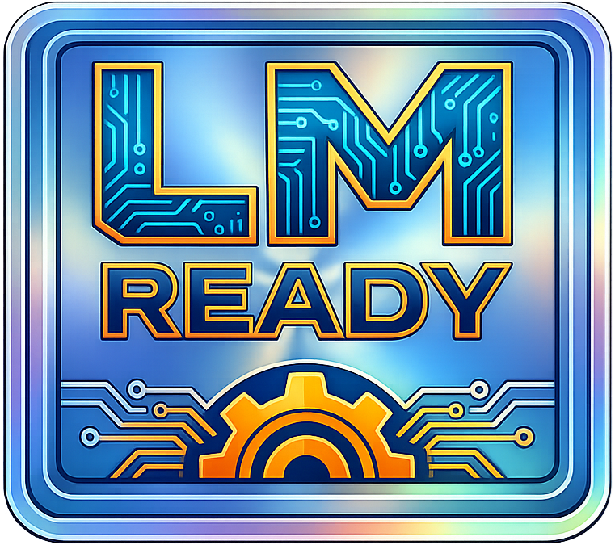

# cnc-content

<p align="center">
  
</p>

<p align="center">
  <a href="https://github.com/iron-curtain-engine/cnc-content/actions/workflows/ci.yml"></a>
  <a href="https://github.com/iron-curtain-engine/cnc-content/actions/workflows/audit.yml"></a>
  <a href="LICENSE"></a>
</p>

<p align="center">
  <a href="https://www.rust-lang.org"></a>
  &nbsp;&nbsp;
  <br>
  
  &nbsp;
  
</p>

Download, verify, and manage Command & Conquer game content from any supported
source. Works as a standalone CLI tool or as a library for engine integration.

## What it does

- **Defines** what each game needs (25 packages, 35 sources, 26 downloads across 7 games)
- **Identifies** content sources on disk (discs, Steam, GOG, Origin, OpenRA, registry, CNCNet)
- **Downloads** freeware content via P2P swarm with HTTP web seeds, or multi-mirror HTTP fallback
- **Extracts** content from MIX, BIG, MEG, BAG/IDX archives, InstallShield CABs, ZIPs, and raw offsets
- **Verifies** source identity (SHA-1) and installed content integrity (BLAKE3 manifests)
- **Streams** media content (video, audio) during download via `p2p-distribute`'s streaming reader
- **Seeds** downloaded content via BitTorrent to reduce mirror load

## Status

> **Alpha / pre-1.0** — core download, verification, source detection, and P2P
> distribution pipeline is functional. The `p2p-distribute` sub-crate provides
> piece-level coordination, streaming, and swarm management.

## Supported Games

| Game                               | Slug       | Status                             |
| ---------------------------------- | ---------- | ---------------------------------- |
| Command & Conquer: Red Alert       | `ra`       | Freeware (EA, 2008) — downloadable |
| Command & Conquer: Tiberian Dawn   | `td`       | Freeware (EA, 2007) — downloadable |
| Dune II: The Building of a Dynasty | `dune2`    | NOT freeware — local source only   |
| Dune 2000                          | `dune2000` | NOT freeware — local source only   |
| Command & Conquer: Tiberian Sun    | `ts`       | Freeware (EA, 2010) — downloadable |
| Command & Conquer: Red Alert 2     | `ra2`      | NOT freeware — local source only   |
| Command & Conquer: Generals        | `generals` | NOT freeware — local source only   |

## Content Sources

| Source                           | Type          | Games                   |
| -------------------------------- | ------------- | ----------------------- |
| OpenRA HTTP mirrors              | Download      | RA, TD                  |
| OpenRA community mirrors         | Download      | RA, TD, TS (music)      |
| Archive.org / CNCNZ              | Download      | RA, TD                  |
| cnc-comm.com disc ISOs           | Download      | TS                      |
| CNCNet                           | Download      | RA, TD, TS              |
| Allied / Soviet / CS / AM Discs  | Disc          | RA                      |
| GDI / Nod / Covert Ops Discs     | Disc          | TD                      |
| The First Decade DVD             | InstallShield | RA, RA2                 |
| Steam — The Ultimate Collection  | Steam         | RA, TD, TS*, RA2*, Gen* |
| Steam — C&C Remastered           | Steam         | RA, TD                  |
| Origin / EA App                  | Origin        | RA, TD, TS, RA2, Gen    |
| GOG.com                          | GOG           | Dune 2, Dune 2000       |
| C&C 1995 (registry)              | Registry      | RA                      |
| Dune 2 / Dune 2000 Discs         | Disc          | Dune 2, Dune 2000       |
| TS / RA2 / Generals Retail Discs | Disc          | TS, RA2, Gen            |
| OpenRA content directory         | OpenRA        | RA, TD                  |

\* Steam app IDs for TS, RA2, and Generals TUC are pending confirmation.

## Freeware Downloads

EA declared Red Alert (2008), Tiberian Dawn (2007), and Tiberian Sun (2010)
as freeware. These resources are available via P2P swarm (BitTorrent + HTTP
web seeds) or direct multi-mirror HTTP.

**P2P-first architecture:** every `.torrent` file embeds
[BEP 19](https://www.bittorrent.org/beps/bep_0019.html) web seed URLs
pointing to HTTP mirrors. The P2P client treats HTTP mirrors and BitTorrent
peers as equal piece sources. Downloads work **with zero BitTorrent peers**
— the client fetches pieces directly from mirrors via Range requests. As the
swarm grows, peers share pieces with each other automatically, reducing
mirror load.

### Red Alert

| Package | Size | HTTP | Torrent |
| ------- | ---: | ---- | ------- |
| Quick Install (Base + AM + Desert) | ~13 MB | [OpenRA mirrors][ra-qi-http] | [.torrent][ra-qi-torrent] |
| Base Game Files | ~12 MB | [OpenRA mirrors][ra-base-http] | [.torrent][ra-base-torrent] |
| Aftermath Expansion | ~639 KB | [OpenRA mirrors][ra-am-http] | [.torrent][ra-am-torrent] |
| C&C Desert Tileset | ~347 KB | [OpenRA mirrors][ra-desert-http] | [.torrent][ra-desert-torrent] |
| Full Discs — Allied + Soviet ISOs | ~1.3 GB | [Archive.org][ra-full-http] | [.torrent][ra-full-torrent] |
| 4-CD Set — Base + CS + AM | ~1.9 GB | [Archive.org][ra-set-http] | [.torrent][ra-set-torrent] |
| Music (scores.mix) | ~50 MB | [mirror list][ra-music-http] | — |
| Allied Campaign Movies | ~300 MB | [mirror list][ra-movies-a-http] | — |
| Soviet Campaign Movies | ~350 MB | [mirror list][ra-movies-s-http] | — |
| Counterstrike Music | ~30 MB | [mirror list][ra-music-cs-http] | — |
| Aftermath Music | ~35 MB | [mirror list][ra-music-am-http] | — |

### Tiberian Dawn

| Package | Size | HTTP | Torrent |
| ------- | ---: | ---- | ------- |
| Base Game (MIX files) | ~7.5 MB | [OpenRA mirrors][td-base-http] · [CDN 1][td-cdn1] · [CDN 2][td-cdn2] | [.torrent][td-base-torrent] |
| GDI Disc ISO | ~581 MB | [CNCNZ][td-gdi-http] · [Archive.org][td-disc-archive] | [.torrent][td-gdi-torrent] |
| Nod Disc ISO | ~565 MB | [CNCNZ][td-nod-http] · [Archive.org][td-disc-archive] | [.torrent][td-nod-torrent] |
| Covert Operations ISO | ~239 MB | [CNCNZ][td-covert-http] | [.torrent][td-covert-torrent] |
| Music | ~40 MB | [mirror list][td-music-http] | — |
| GDI Campaign Movies | ~250 MB | [mirror list][td-movies-gdi-http] | — |
| Nod Campaign Movies | ~250 MB | [mirror list][td-movies-nod-http] | — |

Packages showing "—" for Torrent need their `.torrent` file generated first.

### Tiberian Sun

| Package | Size | HTTP | Torrent |
| ------- | ---: | ---- | ------- |
| Base Files | ~9 MB | [OpenRA mirrors][ts-base-http] | — |
| Quick Install (Base + Expand) | ~12 MB | [OpenRA mirrors][ts-qi-http] | — |
| Firestorm Expansion | ~3 MB | [OpenRA mirrors][ts-expand-http] | — |
| GDI Disc ISO | ~549 MB | [cnc-comm.com][ts-gdi-http] | — |
| Nod Disc ISO | ~550 MB | [cnc-comm.com][ts-nod-http] | — |
| Firestorm Disc ISO | ~549 MB | [cnc-comm.com][ts-fs-http] | — |
| Music | ~42 MB | [community mirrors][ts-music-http] | — |
| Movies | ~1 GB | [mirror list][ts-movies-http] | — |

> **Dune 2, Dune 2000, Red Alert 2, and Generals** are
> NOT freeware. This crate supports local source extraction only for those
> games — users must provide their own legally-obtained copies.

<!-- ── HTTP reference links ─────────────────────────────────────────── -->

[ra-qi-http]: https://www.openra.net/packages/ra-quickinstall-mirrors.txt
[ra-base-http]: https://www.openra.net/packages/ra-base-mirrors.txt
[ra-am-http]: https://www.openra.net/packages/ra-aftermath-mirrors.txt
[ra-desert-http]: https://www.openra.net/packages/ra-cncdesert-mirrors.txt
[ra-full-http]: https://archive.org/details/command-and-conquer-red-alert
[ra-set-http]: https://archive.org/details/red_alert_cd
[ra-music-http]: https://raw.githubusercontent.com/iron-curtain-engine/content-bootstrap/main/mirrors/ra-music.txt
[ra-movies-a-http]: https://raw.githubusercontent.com/iron-curtain-engine/content-bootstrap/main/mirrors/ra-movies-allied.txt
[ra-movies-s-http]: https://raw.githubusercontent.com/iron-curtain-engine/content-bootstrap/main/mirrors/ra-movies-soviet.txt
[ra-music-cs-http]: https://raw.githubusercontent.com/iron-curtain-engine/content-bootstrap/main/mirrors/ra-music-counterstrike.txt
[ra-music-am-http]: https://raw.githubusercontent.com/iron-curtain-engine/content-bootstrap/main/mirrors/ra-music-aftermath.txt

[td-base-http]: https://www.openra.net/packages/cnc-mirrors.txt
[td-cdn1]: https://cdn.mailaender.name/openra/cnc-packages.zip
[td-cdn2]: https://openra.0x47.net/cnc-packages.zip
[td-gdi-http]: https://files.cncnz.com/cc1_tiberian_dawn/full_game/GDI95.zip
[td-nod-http]: https://files.cncnz.com/cc1_tiberian_dawn/full_game/NOD95.zip
[td-disc-archive]: https://archive.org/details/cnc-dos-eng-v-1.22
[td-covert-http]: https://files.cncnz.com/cc1_tiberian_dawn/full_game/CovertOps_ISO.zip
[td-music-http]: https://raw.githubusercontent.com/iron-curtain-engine/content-bootstrap/main/mirrors/td-music.txt
[td-movies-gdi-http]: https://raw.githubusercontent.com/iron-curtain-engine/content-bootstrap/main/mirrors/td-movies-gdi.txt
[td-movies-nod-http]: https://raw.githubusercontent.com/iron-curtain-engine/content-bootstrap/main/mirrors/td-movies-nod.txt

[ts-base-http]: https://www.openra.net/packages/ts-mirrors.txt
[ts-qi-http]: https://www.openra.net/packages/ts-quickinstall-mirrors.txt
[ts-expand-http]: https://www.openra.net/packages/fs-mirrors.txt
[ts-gdi-http]: https://bigdownloads.cnc-comm.com/ts/TS_GDI.zip
[ts-nod-http]: https://bigdownloads.cnc-comm.com/ts/TS_Nod.zip
[ts-fs-http]: https://bigdownloads.cnc-comm.com/ts/TS_Firestorm.zip
[ts-music-http]: https://openra.baxxster.no/openra/ts-music.zip
[ts-movies-http]: https://raw.githubusercontent.com/iron-curtain-engine/content-bootstrap/main/mirrors/ts-movies.txt

<!-- ── Torrent file reference links ────────────────────────────────── -->
<!-- Our generated .torrent files (GitHub Pages) contain BEP 19 web seeds -->
<!-- so downloads work with zero BT peers via HTTP Range requests.        -->

[ra-qi-torrent]: https://iron-curtain-engine.github.io/cnc-content/torrents/raquickinstall.torrent
[ra-base-torrent]: https://iron-curtain-engine.github.io/cnc-content/torrents/rabasefiles.torrent
[ra-am-torrent]: https://iron-curtain-engine.github.io/cnc-content/torrents/raaftermath.torrent
[ra-desert-torrent]: https://iron-curtain-engine.github.io/cnc-content/torrents/racncdesert.torrent
[td-base-torrent]: https://iron-curtain-engine.github.io/cnc-content/torrents/tdbasefiles.torrent
[td-gdi-torrent]: https://iron-curtain-engine.github.io/cnc-content/torrents/tdgdiiso.torrent
[td-nod-torrent]: https://iron-curtain-engine.github.io/cnc-content/torrents/tdnodiso.torrent
[td-covert-torrent]: https://iron-curtain-engine.github.io/cnc-content/torrents/tdcovertops.torrent

<!-- Archive.org .torrent files (hosted by Archive.org, actively seeded) -->

[ra-full-torrent]: https://archive.org/download/command-and-conquer-red-alert/command-and-conquer-red-alert_archive.torrent
[ra-set-torrent]: https://archive.org/download/red_alert_cd/red_alert_cd_archive.torrent

## Download Architecture

Downloads use a **P2P-first** transport with multi-tier HTTP fallback:

1. **P2P with web seeds (default)** — BitTorrent via `librqbit` behind the
   `torrent` feature flag. HTTP mirrors serve as
   [BEP 19](https://www.bittorrent.org/beps/bep_0019.html) web seeds in
   the piece coordinator, so downloads work with **zero peers**. As real
   peers join the swarm, pieces flow via P2P too, reducing mirror load.
   Piece-level SHA-1 verification on every piece, regardless of source.

2. **FlashGet-style segmented HTTP** — when P2P is unavailable, the file is
   split into N segments (one per mirror, minimum 1 MB each) and each mirror
   fetches its byte range concurrently via HTTP Range requests. Bandwidth is
   aggregated across all mirrors.

3. **Parallel mirror racing (last resort)** — if Range is unsupported or
   only one mirror is available, all mirrors start concurrently and the first
   successful complete download wins. Losers are cancelled.

### Seeding Policies

After download, the client can seed content back to the swarm:

| Policy   | CLI flag   | Behavior                                         |
| -------- | ---------- | ------------------------------------------------ |
| `pause`  | `--seed pause`  | Seed when idle, pause during online play (default) |
| `always` | `--seed always` | Seed continuously                                |
| `keep`   | `--seed keep`   | Keep archives on disk but never upload           |
| `delete` | `--seed delete` | Extract content, then delete archives            |

## Archive Formats

| Format | Extension | Games | Module |
| ------ | --------- | ----- | ------ |
| MIX (Westwood) | `.mix` | RA, TD, TS | `cnc-formats` |
| BIG/BIG4 (EA) | `.big` | Generals | `cnc-formats` |
| MEG (Petroglyph) | `.meg` | — (future) | `cnc-formats` |
| BAG/IDX (RA2) | `.bag`/`.idx` | RA2 | `cnc-formats` |
| InstallShield CAB v5/v6 | `.cab` | RA (TFD) | `iscab` |
| ZIP (deflate) | `.zip` | RA, TD, TS | `zip` |
| Raw byte offset | — | various | built-in |

## p2p-distribute

[`p2p-distribute`](crates/p2p-distribute/) is a **standalone, general-purpose**
piece-level download coordinator. It is MIT/Apache-2.0 licensed and published
as an independent crate.

Any project that needs to coordinate piece-based downloads from multiple
sources (HTTP mirrors, BitTorrent peers, custom transports) can use it
directly.

**Repository:** [`iron-curtain-engine/p2p-distribute`](https://github.com/iron-curtain-engine/p2p-distribute)

### What it provides

- **Piece coordinator** — schedules piece downloads across any number of
  peers, with SHA-1 verification on every piece, retry rotation, peer
  blacklisting, minimum-speed eviction, and endgame mode
- **Streaming reader** — `Read + Seek` over partially-downloaded files,
  blocking only when needed bytes haven't arrived yet. Enables video/audio
  playback during download
- **Pluggable peer trait** — the `Peer` trait abstracts any data source.
  Built-in `WebSeedPeer` fetches via HTTP Range requests. Consumers bring
  their own BitTorrent backend by implementing `Peer`
- **Deterministic torrent creation** — generate `.torrent` files with
  BEP 19 web seeds and tracker URLs. Same input = identical `info_hash`

### Subsystems

#### Peer Management

| Component | Purpose |
| --------- | ------- |
| `PeerPool` | Bounded peer set (default 55) with exponential backoff reconnection |
| `PeerStats` / `PeerTracker` | Composite scoring: Speed (0.4) + Reliability (0.3) + Availability (0.2) + Recency (0.1) |
| `AffinityScorer` | Geographic/topological peer preference: Region (0.25) + Latency (0.40) + Speed (0.35) |
| `PhiDetector` | Phi accrual failure detection (Cassandra/Akka pattern) for peer liveness |
| `PeerId` | Cryptographic peer identity — auto-generated, SHA-256 derived, or Ed25519 |

#### Piece Scheduling & Verification

| Component | Purpose |
| --------- | ------- |
| `SharedPieceMap` | Atomic per-piece state tracking (`AtomicU8` per piece) |
| `PieceSelection` | Rarest-first selection weighted by streaming priority |
| `PiecePriority` | DASH/HLS-style streaming priority (Critical → High → Normal → Low) |
| `EndgameMode` | BEP 3 endgame — broadcast remaining blocks, cancel duplicates |
| `PieceValidator` | Extended validation with Merkle sub-piece localisation and quarantine |
| `MerkleTree` | SHA-256 Merkle tree (256 KiB leaves) for sub-piece corruption localisation (aMule AICH) |
| `CorruptionLedger` | Byte-range blame attribution to identify which peer sent corrupt data |

#### Trust & Bandwidth

| Component | Purpose |
| --------- | ------- |
| `TitForTatChoking` | BEP 3 tit-for-tat with optimistic unchoking and credit weighting |
| `CreditLedger` | eMule bilateral credit system |
| `BandwidthThrottle` | Global byte-volume token bucket (aria2 pattern) |
| `RateLimiterMap` | Per-entity request-count rate limiting |
| `ConnectionBudget` | libp2p-style limits: max total (50), per-peer (1), pending (10) |
| `AdaptiveConcurrency` | FlashGet adaptive concurrency: ramp up on +10% throughput, back off -20% |

#### Network & Discovery

| Component | Purpose |
| --------- | ------- |
| `DhtNode` / `RoutingTable` | Kademlia DHT — O(log N) lookup, k=20 buckets, α=3 parallel queries |
| `PexMessage` | BEP 11 Peer Exchange gossip |
| `LpdService` | BEP 14 LAN multicast peer discovery |
| `TrackerState` | BEP 3 HTTP + BEP 15 UDP tracker |
| `SourceRegistry` | Pluggable source discovery with trust scoring and freshness |
| `RelayNode` | CnCNet-inspired NAT traversal and connection relaying |
| `NetworkId` | Network isolation tag (SSB Secret Handshake pattern) |

#### Wire Protocol

| Component | Purpose |
| --------- | ------- |
| `PeerMessage` | Full BEP 3 message codec (Choke, Unchoke, Have, Bitfield, Request, Piece, Cancel, etc.) |
| `Capabilities` | IRC ISUPPORT-style capability bits (encryption, Merkle, PEX, DHT, web seeds, streaming) |
| `FastMessage` | BEP 6 Fast Extension — SuggestPiece, HaveAll, HaveNone, RejectRequest, AllowedFast |
| `MetadataExchange` | BEP 9 magnet URI metadata download |
| `BencodeValue` | Zero-copy bencode codec with depth limit |

#### Streaming & Gateway

| Component | Purpose |
| --------- | ------- |
| `StreamingReader` | `Read + Seek` over partial downloads, condvar-based blocking |
| `BandwidthEstimator` | Dual EWMA (fast α=0.5, slow α=0.1) for DASH-style adaptive prebuffering |
| `BufferPolicy` | Controls how far ahead the P2P layer prefetches |
| `GatewayAdapter` | Bridges HTTP Range requests to `StreamingReader` |
| `RangeRequest` | RFC 7233 range parser for HTTP-to-P2P gateway |

#### Bridge (P2P ↔ HTTP)

| Component | Purpose |
| --------- | ------- |
| `BridgeNode` | P2P-to-HTTP bridge — participates in swarm, sources data from HTTP mirrors |
| `BridgePeer` | Implements `Peer` trait backed by healthiest mirror, with prefetch |
| `DemandTracker` | Exponential-decay heat tracking for proactive prefetch |
| `PieceCache` | LRU piece cache for bridge nodes |
| `PieceDataCache` | ARC (Adaptive Replacement Cache) for seeding — scan-resistant, default 32 MiB |

#### Group Replication (Managed Content Distribution)

| Component | Purpose |
| --------- | ------- |
| `GroupRoster` | Closed share group RBAC — Master, Admin, Mirror, Reader roles (max 500 members) |
| `GroupManifest` | Versioned, signed content catalog (SHA-256 hashes, sorted by path) |
| `CatalogSigner` / `CatalogVerifier` | Pluggable manifest signing (HMAC-SHA256 built-in) |
| `SyncPlan` | Manifest diff → Download/Delete action plan |
| `ReplicationPolicy` | Full mirror or prefix-filtered partial replication |

#### Upload & Seeding

| Component | Purpose |
| --------- | ------- |
| `UploadQueue` | XDCC-style bounded upload slots (default 4) + FIFO queue (default 20) |
| `SuperSeedState` | BEP 16 super-seeding — maximise piece diversity from initial seeder |

#### Storage & Resume

| Component | Purpose |
| --------- | ------- |
| `FileStorage` / `MemoryStorage` | Pluggable piece storage via `PieceStorage` trait |
| `CoalescingStorage` | Write-coalescing wrapper for sequential I/O |
| `ResumeState` | Crash recovery — compact binary bitfield for download resume |
| `BasicSession` | Multi-download queue with configurable concurrency (default 3 active) |

#### Security

| Component | Purpose |
| --------- | ------- |
| `ObfuscationKey` | eMule-style XOR stream masking + random port (anti-DPI) |
| `WorkStealingScheduler` | Lock-free atomic byte-range bisection for parallel downloads |

### Design inspiration

`p2p-distribute` draws from proven P2P protocols and networking patterns:

| Pattern | Origin | Used in |
| ------- | ------ | ------- |
| Tit-for-tat + optimistic unchoke | BitTorrent BEP 3 | `choking` |
| AICH corruption localisation | aMule/eMule | `merkle`, `corruption_ledger` |
| Bilateral credit | eMule | `credit` |
| Phi accrual failure detector | Cassandra/Akka | `phi_detector` |
| ARC cache | Megiddo & Modha 2003 | `piece_data_cache` |
| Adaptive concurrency | FlashGet | `adaptive` |
| NAT traversal relays | CnCNet | `relay` |
| Key-as-identity | Hamachi | `peer_id` |
| Network isolation | SSB Secret Handshake | `network_id` |
| XDCC slot queuing | IRC XDCC bots | `upload_queue` |
| Connection budget | libp2p | `budget` |

## Installation

Install from source with Cargo:

```sh
cargo install --git https://github.com/iron-curtain-engine/cnc-content.git
```

Or build locally:

```sh
git clone https://github.com/iron-curtain-engine/cnc-content.git
cd cnc-content
cargo build --release
# Binary at target/release/cnc-content(.exe)
```

## CLI

Build with the `cli` feature (default) for the `cnc-content` command:

```sh
cnc-content status                    # show installed/missing packages
cnc-content download                  # download all required content
cnc-content download --all            # download required + optional (music, movies)
cnc-content download --package music  # download a specific package
cnc-content -g td download            # download Tiberian Dawn content
cnc-content -g ts download            # download Tiberian Sun content
cnc-content verify                    # check installed content integrity
cnc-content detect                    # scan for local content sources
cnc-content install /path/to/source   # install from a local disc/Steam/GOG path
cnc-content identify <path>           # identify a content source at a path
cnc-content games                     # list supported games
cnc-content clean                     # remove all downloaded content
cnc-content seed-config               # show current P2P seeding policy
cnc-content seed-config always        # change seeding policy
cnc-content torrent-create            # generate .torrent files (maintainer tool)
```

### Global Options

```
-g, --game <SLUG>      Game to manage [default: ra]
                       (ra, td, ts, dune2, dune2000, ra2, generals)
--content-dir <PATH>   Content directory override
                       (default: portable, next to executable)
                       (env: CNC_CONTENT_ROOT)
--openra               Use OpenRA's content directory (share files between engines)
```

### Download Options

```
--all                  Download optional content too (music, movies)
--package <NAME>       Download a specific package by name
--seed <POLICY>        Seeding policy (pause, always, keep, delete)
```

## Library Usage

```rust
use cnc_content::GameId;

// Check if Red Alert content is complete
let root = std::path::Path::new("/path/to/content/ra/v1");
if !cnc_content::is_content_complete(root, GameId::RedAlert) {
    let missing = cnc_content::missing_required_packages(root, GameId::RedAlert);
    for pkg in missing {
        eprintln!("missing: {}", pkg.title);
    }
}
```

## Features

| Feature       | Default | Description                                                    |
| ------------- | ------- | -------------------------------------------------------------- |
| `cli`         | Yes     | `cnc-content` binary with progress bars (implies `download`)   |
| `download`    | Yes     | HTTP download + ZIP extraction (`ureq`, `zip`)                 |
| `fast-verify` | Yes     | Parallel BLAKE3 verification via `rayon` + SIMD bitfields      |
| `torrent`     | No      | BitTorrent P2P transport via `librqbit` (implies `download`)   |

## Environment Variables

| Variable               | Purpose                                        | Default                                   |
| ---------------------- | ---------------------------------------------- | ----------------------------------------- |
| `CNC_CONTENT_ROOT`     | Override the content directory                 | Portable path next to executable          |
| `CNC_MIRROR_LIST_URL`  | Override the mirror list URL for all downloads | Per-package URL from download definitions |
| `CNC_DOWNLOAD_TIMEOUT` | HTTP download timeout in seconds               | `300`                                     |
| `CNC_NO_P2P`           | Disable P2P transport (`1` = disabled)         | `0` (P2P enabled when compiled in)        |

CLI flags take precedence over environment variables.

## Design

This crate is part of the [Iron Curtain](https://github.com/iron-curtain-engine/iron-curtain)
engine ecosystem but works standalone without any game engine dependency.

Dependencies:
- [`cnc-formats`](https://github.com/iron-curtain-engine/cnc-formats)
  (MIT/Apache-2.0) — binary format parsing (MIX, BIG, MEG, BAG/IDX archives)
- [`p2p-distribute`](https://github.com/iron-curtain-engine/p2p-distribute)
  (MIT/Apache-2.0) — piece-level download coordination, streaming, P2P transport

This crate itself is GPL-3.0-or-later because it implements game-specific
content management logic that references EA-derived knowledge (file layouts,
content definitions from OpenRA's GPL-licensed data).

### Key properties

- **No Bevy dependency** — pure Rust library, usable by any project
- **P2P-first** — BitTorrent swarm with HTTP web seeds as equal piece sources
- **Offline-first** — content is cached locally after first download
- **OpenRA-compatible** — uses the same mirror infrastructure and file layout
- **Feature-gated networking** — `download` feature pulls in `ureq` + `zip`;
  disable it for library-only use without HTTP dependencies
- **Freeware-only downloads** — only EA-declared freeware (RA, TD, TS) can be
  downloaded; all other games require user-owned copies
- **Streaming playback** — video and audio content can be played during
  download via `p2p-distribute`'s `StreamingReader`

## Design Documents

Architecture and format specifications are maintained in the
[Iron Curtain Design Documentation](https://github.com/iron-curtain-engine/iron-curtain-design-docs).

Key references:
- [D076 — Standalone crate extraction](https://iron-curtain-engine.github.io/iron-curtain-design-docs/decisions/09a/D076-standalone-crates.html)

## License

Licensed under the GNU General Public License v3.0 or later — see [LICENSE](LICENSE).

## Contributing

Contributions require a Developer Certificate of Origin (DCO) — add `Signed-off-by`
to your commit messages (`git commit -s`).

Unless you explicitly state otherwise, any contribution intentionally submitted
for inclusion in this crate by you shall be licensed under GPL-3.0-or-later,
without any additional terms or conditions.

## Legal Notices

This project is **not affiliated with, endorsed by, or sponsored by Electronic
Arts Inc.** or any of its subsidiaries.

Command & Conquer™, Red Alert™, Tiberian Dawn™, Tiberian Sun™, Dune™,
Red Alert 2™, and Generals™ are trademarks or registered trademarks of
Electronic Arts Inc. All other trademarks are the property of their respective
owners. These names are used solely for identification and interoperability
purposes under nominative fair use.

This software ships **zero copyrighted game content**. It downloads content
that EA has publicly declared freeware, or extracts content from
user-owned copies. Users are responsible for ensuring their use complies
with applicable laws in their jurisdiction.

THIS SOFTWARE IS PROVIDED "AS IS", WITHOUT WARRANTY OF ANY KIND. See the
[GNU General Public License v3.0](LICENSE) for full warranty disclaimer and
limitation of liability terms (sections 15–17).
